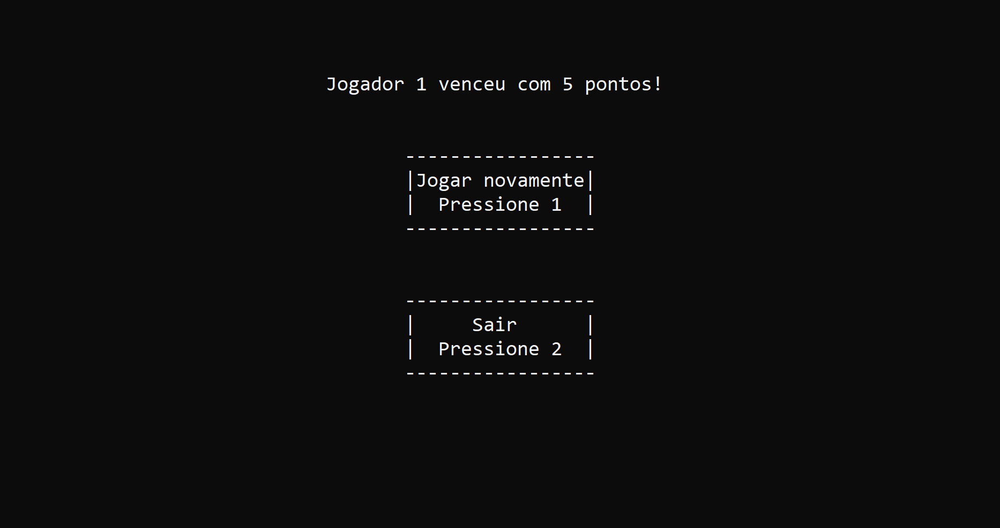

# Matching-Game

**Jogo da memória desenvolvido em linguagem C para ser jogado por 2 jogadores**

**Memory game developed in C language to be played by 2 players**

## Instruções para executar / Instructions to execute
Para conseguir executar o código é necessário instalar a biblioteca conio.c. Seguir o tutorial do arquivo [Conio.c - Como instalar.txt](Conio.c-library/Conio.c_Como_Instalar.txt) 

To be able to run the code you need to install the library conio.c. Follow the tutorial file [Conio.c - Como instalar.txt](Conio.c-library/Conio.c_Como_Instalar.txt)

## Demonstrações de funcionamento / Operations demonstration
### Tela inicial / Initial screen

### Tela do jogo / Game screen

#### Dificuldade fácil / Easy difficulty

#### Dificuldade médio / Medium difficulty

#### Dificuldade difícil / Hard difficulty

### Tela final / Final screen

      

